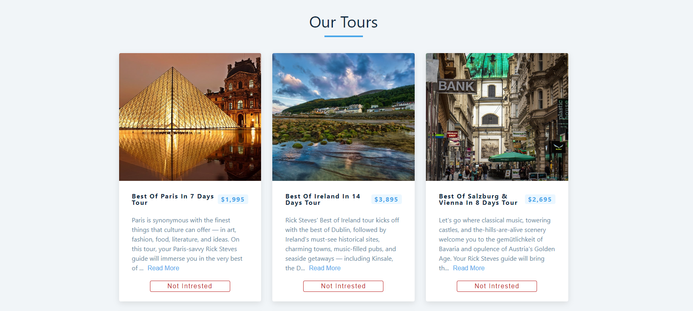

<h1 align="center">
  Tours Packages
</h1>

<p align="center">
  
</p>

<p align="center">
  Discover and book your dream tours with ease. Tours Packages is an interactive website that offers a wide range of tour packages to exciting destinations, powered by React.
</p>

<p align="center">
  <a href="https://tours-pamphlet.netlify.app/">View Live Demo</a>
</p>

---

## Overview

Tours Packages is a dynamic web application that simplifies the process of finding and booking tour packages. It provides an engaging and interactive user experience, allowing users to explore various destinations, view detailed tour information, and make reservations seamlessly.

The project is built using HTML, CSS, JavaScript, and leverages the power of React to create a responsive and intuitive user interface. With React's component-based architecture, the application offers modular and reusable code, enhancing development efficiency and maintainability.

## Features

- Browse through an extensive collection of tour packages
- View detailed information, including destination highlights, itinerary, and pricing
- Interactive interface with smooth transitions and animations
- Filter and sort tours based on preferences
- User-friendly booking process

## Usage

1. Clone the repository:

   ```bash
   git clone https://github.com/Meenakshi-Sivakumar/Tour-React-App.git
